# Etapp
Activity sharing based social platform application that has been developing with Java and Firebase Services.

<table>
  <tr>
    <td>
      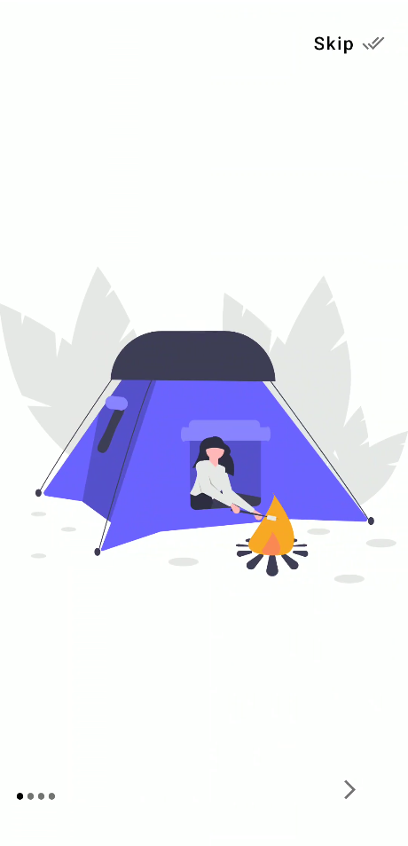 
    </td>
    <td>
      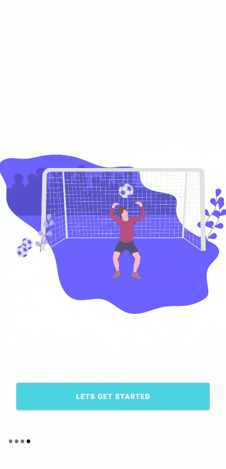 
    </td>
    <td>
      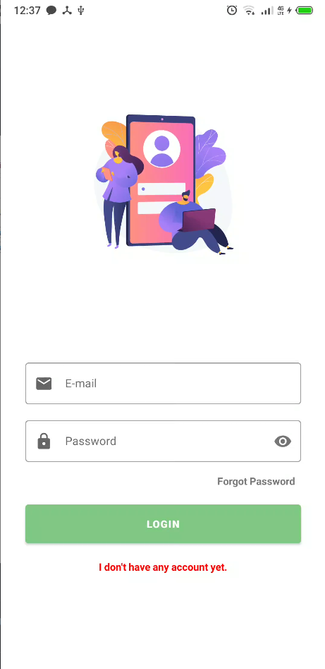 
    </td>
  </tr>
  <tr>
    <td>
      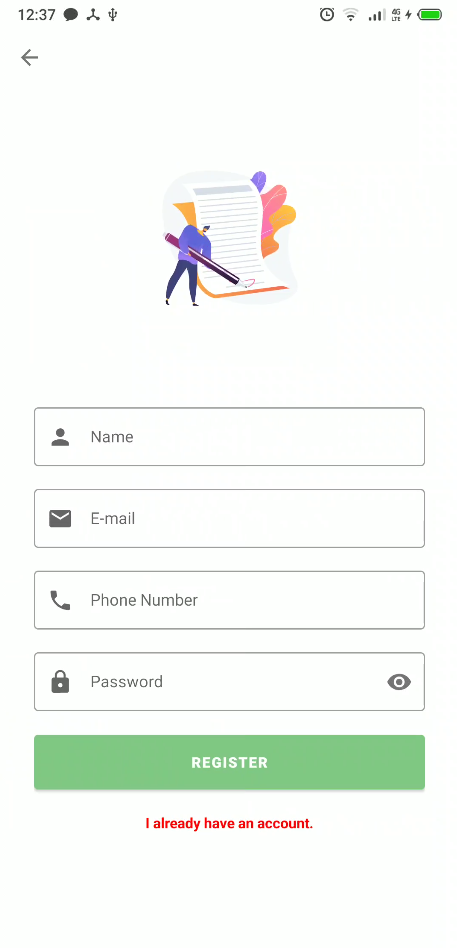 
    </td>
    <td>
      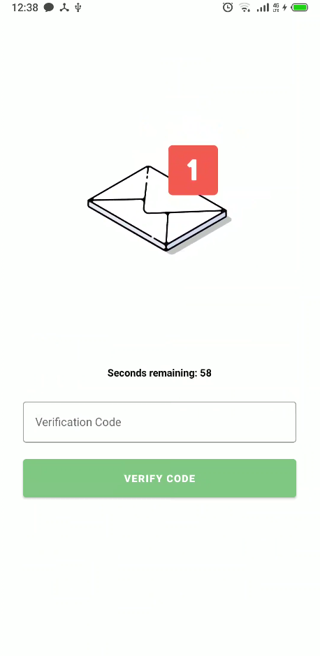 
    </td>
    <td>
      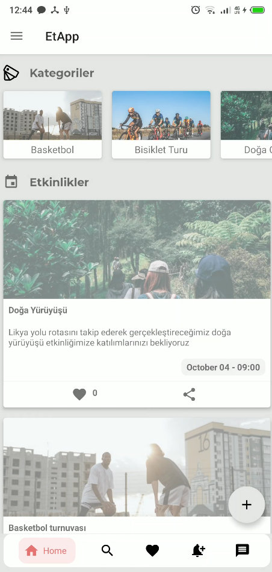 
    </td>
  </tr>
  <tr>
    <td>
      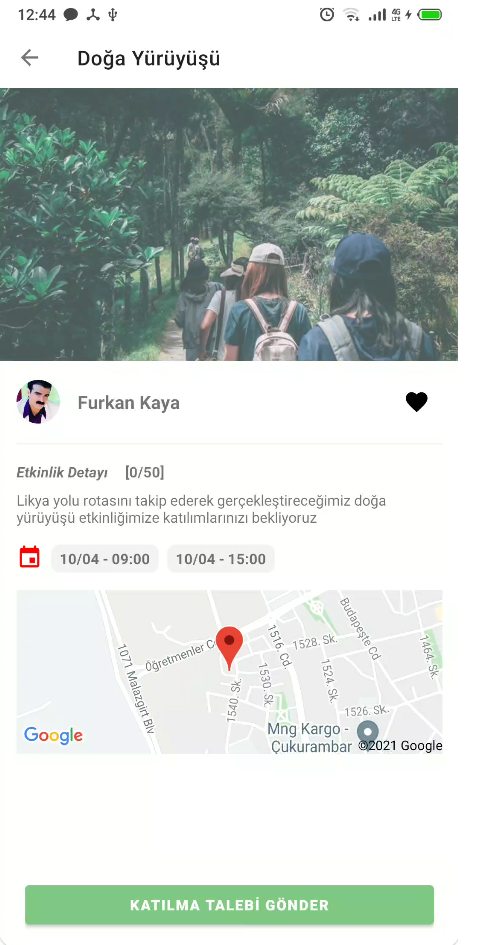 
    </td>
    <td>
      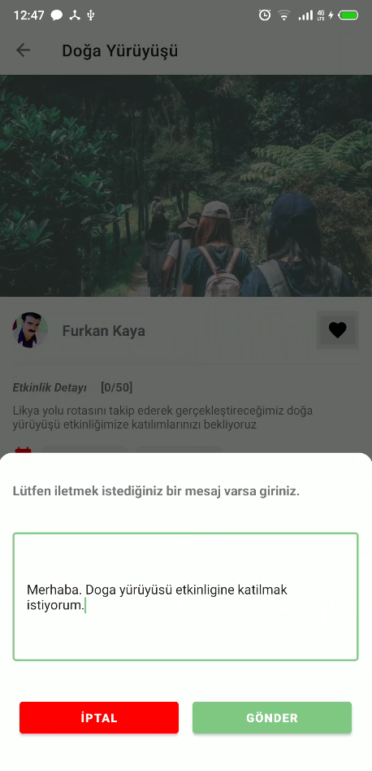 
    </td>
    <td>
      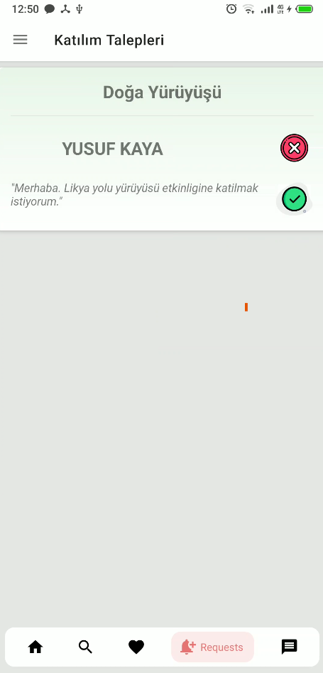 
    </td>
  </tr>
  <tr>
    <td>
      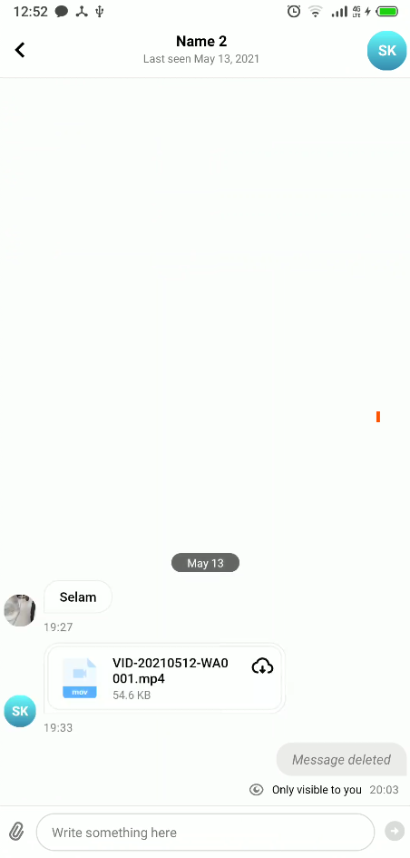 
    </td>
    <td>
      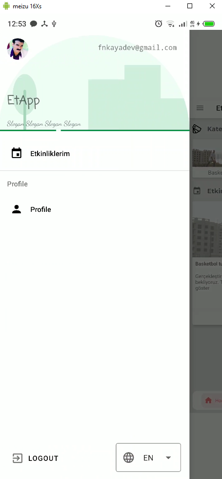 
    </td>
    <td>
      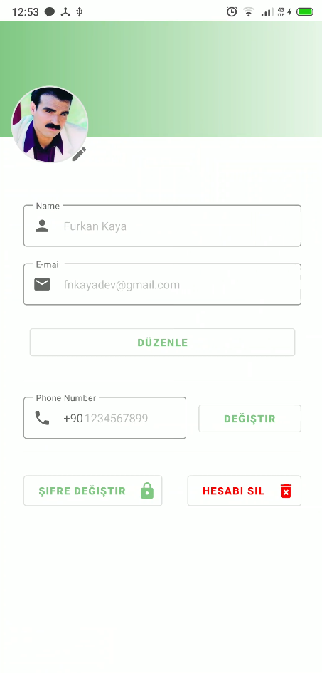 
    </td>
  </tr>
</table>

